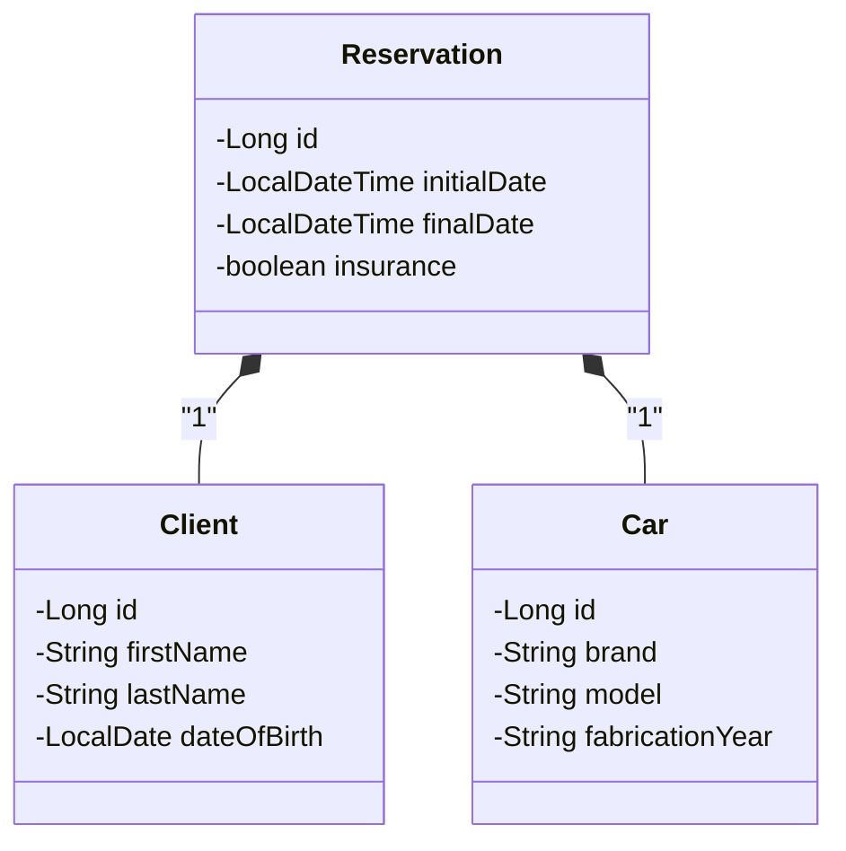

## Car Rental API 

## Tecnologies Used
 - **Java 21**;
 - **Spring Boot 3**;
 - **Spring Data JPA**;
 - **OpenAPI (Swagger)**;
 - **Railway**.

## Class Diagram

```mermaid
classDiagram
    class Reservation {
        -Long id
        -LocalDateTime initialDate
        -LocalDateTime finalDate
        -boolean insurance
    }
    
    class Client {
        -Long id
        -String firstName
        -String lastName
        -LocalDate dateOfBirth
    }

    class Car {
        -Long id
        -String brand
        -String model
        -String fabricationYear
    }

    Reservation *-- Client : "1"  
    Reservation *-- Car : "1"
```
